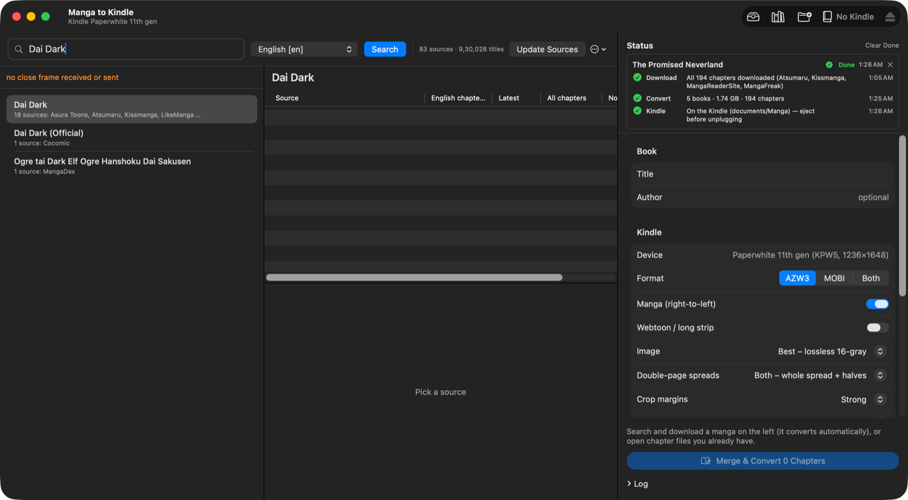
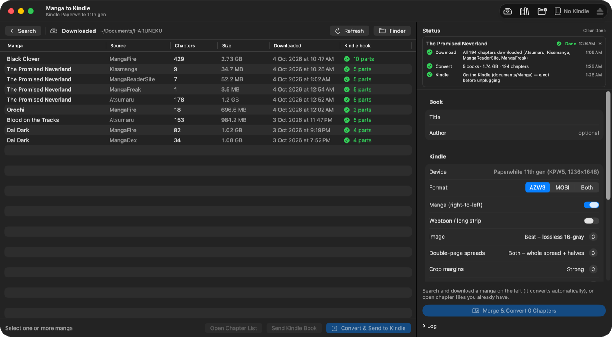
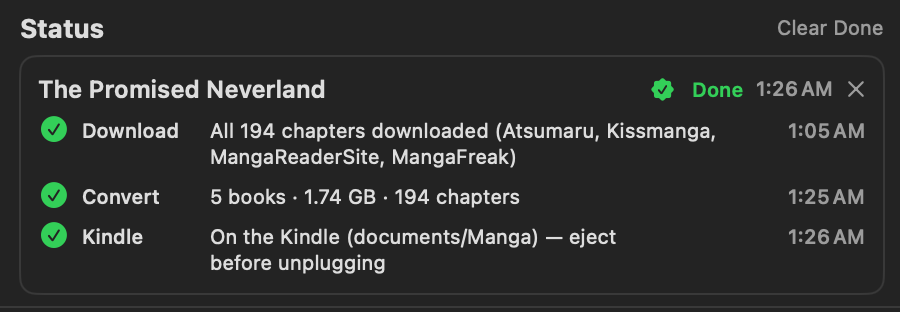

# Manga to Kindle (macOS)

A native SwiftUI Mac app that searches and downloads manga (driving [HaruNeko](https://github.com/manga-download/haruneko) hidden in
the background), merges the chapters in order into one book, converts it with [Kindle Comic Converter](https://github.com/ciromattia/kcc)
for the Kindle Paperwhite 11th gen (lossless 16-gray AZW3), and copies it to the Kindle over USB.



| Downloaded series, ready to convert & send | Every step of every book |
|---|---|
|  |  |

## Features
- Search every HaruNeko source at once; sources ranked by how many chapters they have in your language.
- Download → convert → send to Kindle automatically; books over ~600 MB are split into parts.
- **PDF for KOReader** (recommended on a Paperwhite 11th gen): lossless pages at the device's exact resolution, a chapter list,
  split at chapter boundaries for big series. Kindle firmware 5.19.2 makes sideloaded AZW3/MOBI/KFX comics ghost (leftovers of the
  previous page, even with Page Refresh on) and older Kindles never got the fix; KOReader on a jailbroken Kindle reads these PDFs
  right-to-left with a full refresh on every page. **Kindle → Set Up KOReader for Manga** writes those settings (page view, fit page,
  no page gap, no accidental jumps from corner/bottom-edge taps, double-tap off).
- Gentle copying to the Kindle (synced in chunks with short pauses) — sustained full-speed transfers made the Kindle drop out of USB mode.
- Conversion speed: Cool (2 threads) or Fast (all but one thread).
- KFX output via [kindle-comic-workaround-5.19.x](https://github.com/HankunYu/kindle-comic-workaround-5.19.x) (cloned by `setup.sh`)
  for the Kindle's own reader — it fixes white borders on 5.19.x, but not the ghosting.
- Failed chapters are fetched from the next best source automatically (only the missing ones); one book in the end.
- Survives quitting the app or restarting the Mac: downloads resume where they stopped.
- Handles blocked sites: fresh API token on MangaHub-family rate limits; Cloudflare checks via a hidden browser or a “Verify Now” prompt.
- Status panel: every manga's Download / Convert / Kindle step with progress and done/failed state.
- HaruNeko stays completely invisible (no window, no Dock icon) unless a site needs a human check.
- `open -a "Manga to Kindle" --args --search "Dai Dark"` opens the app with a search.
- “Downloaded” and “On Kindle” views (convert what you already have; list/delete books on the Kindle), safe eject, auto-eject before sleep.

## Layout
- `app/` — SwiftUI app (`Sources/*.swift`), built with `swiftc` by `app/build.sh` (no Xcode project).
- `engine/` — Python helpers the app runs: `mangamerge.py` (scan/merge/KCC), `haru.py` + `haru_page.js` (HaruNeko over the
  Chrome DevTools Protocol), `kindle.py` (detect/send/list/delete/eject), `calibre_send.py`, vendored `kindleunpack` (GPLv3).

## Build
```sh
./setup.sh                 # Python 3.12 venv (uv) + KCC v12.0.0 into kcc-src/ + KFX writer into kfx-tool/
# put kindlegen at bin/kindlegen (extract from Kindle Previewer: pkgutil --expand-full, KFXGen/bin/kindlegen)
cd app && ./build.sh       # → app/build/Manga to Kindle.app
```
Requires HaruNeko at `/Applications/HakuNeko.app`.

## License
Copyright (C) 2026 Ritom Puzari

This program is free software: you can redistribute it and/or modify it under the terms of the
GNU General Public License as published by the Free Software Foundation, either version 3 of the License,
or (at your option) any later version. See [LICENSE](LICENSE).

Includes `engine/kindleunpack` (KindleUnpack, GPLv3). Uses, but does not include, Kindle Comic Converter (ISC),
HaruNeko, Amazon kindlegen and kindle-comic-workaround-5.19.x (no license; cloned at setup, not redistributed).
